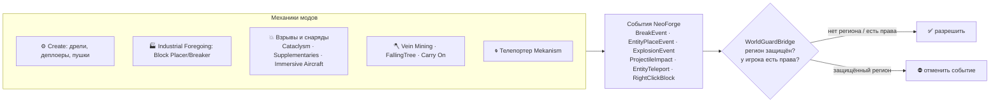

<p align="center"></p>

<div align="center">


[](https://github.com/VOIDRP-MINECRAFT/wg-region-guard/actions/workflows/build.yml)


</div>

> NeoForge 1.21.1 мод — блокирует обход защиты WorldGuard регионов через механики модов.

---

## 🗺️ Место в экосистеме



**Проблема:** WorldGuard защищает регионы от игроков, но не от не-игровых механик модов. Машины Create, буры, сеятели, снаряды и боссы могут свободно разрушать и строить в защищённых зонах.

---

## ✨ Что блокируется

| Категория | Механика |
|---|---|
| **Create** | Deployer, пушки, механизмы block-place/break |
| **Industrial Foregoing** | Block Placer, Block Breaker |
| **Supplementaries** | Рогатка, говорящий блок, player interactions |
| **Carry On** | Поднятие tile entity в защищённом регионе |
| **Mekanism** | Телепортация в защищённый регион |
| **L_Ender's Cataclysm** | Атаки боссов на защищённые блоки |
| **Immersive Aircraft** | Повреждения от летательных аппаратов |
| **Vein Mining** | Цепная добыча за границами региона |
| **Falling Tree** | Обрушение дерева за пределы исходного региона |
| **Взрывы** | Любые модовые взрывы на защищённых блоках |
| **Не-игровые entity** | Любой block-break/place от не-player entity |

---

## 📋 Требования

| Компонент | Версия |
|---|---|
| Minecraft | 1.21.1 |
| NeoForge | 21.1.x |
| WorldGuard | через Bukkit/Mohist bridge |
| Java | 21 |

Требует Mohist или аналогичный гибридный сервер с поддержкой Bukkit API на NeoForge.

---

## 🚀 Сборка и установка

```bash
./gradlew build
```

Скопировать jar в `mods/` сервера — мод начинает работать сразу.

---

## ⚙️ Конфигурация

`config/wg-region-guard-server.toml` — каждую защиту можно выключить отдельно (все включены по умолчанию):

| Параметр | Что запрещает в защищённом регионе |
|---|---|
| `blockMachineBreak` · `blockMachinePlace` | Ломать и ставить блоки не-игровыми сущностями (дрели, деплоеры, Block Breaker/Placer) |
| `blockVeinMining` | Цепную добычу в другом регионе, чем исходный блок |
| `blockFallingTree` | Рубку брёвен внутри региона деревом, срубленным снаружи |
| `blockSupplementaries` | Попадания рогатки и активацию говорящего блока |
| `blockCreateDeployer` · `blockCreateCannons` | Деплоеры и урон блокам от Create Big Cannons |
| `blockIFPlacer` · `blockIFBreaker` | Block Placer/Breaker из Industrial Foregoing |
| `blockCarryOn` | Поднимать блоки с содержимым без прав на регион |
| `blockMekanismTeleporter` | Телепорт Mekanism в регионы с запретом входа |
| `blockCataclysm` | Разрушение блоков боссами L_Ender's Cataclysm |
| `blockImmersiveAircraft` | Урон блокам от летательных аппаратов |
| `blockModdedExplosions` | Модовые взрывы по защищённым блокам |

---

## 🔗 Связанные репозитории

| Репо | Связь |
|---|---|
| [voidrp-gamesync-plugin](https://github.com/VOIDRP-MINECRAFT/voidrp-gamesync-plugin) | Управляет регионами наций через WorldGuard |
| [voidrp-async-ai](https://github.com/VOIDRP-MINECRAFT/voidrp-async-ai) | Параллельный performance-мод на сервере |

---

<div align="center">
<a href="https://void-rp.ru">🌐 Сайт</a> ·
<a href="https://github.com/VOIDRP-MINECRAFT">🏠 Организация</a>
</div>
